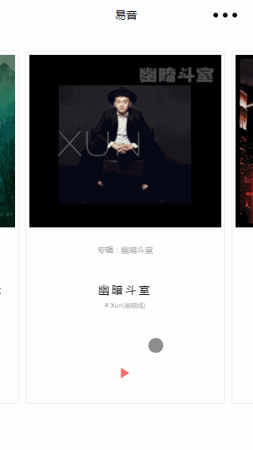

## 微信小程序 滚动插件 xHSwiper

#### 需求描述
* 传入一个数组元素，每个元素就是对应的视图应该有的数据
* 跟随手指滑动,手指滑动结束后，智能判断当前视图是第几个视图，并且将当前视图显示在屏幕中央,支持纵向滚动即可
* 每个视图的宽度可控
* 提供每次滑动结束后的事件
* 提供滑动到第一个视图的事件，并提供当前是第几个视图，对应的视图数据
* 提供滑动到最后个视图的事件，并提供当前是第几个视图，对应的视图数据
* 动态的 添加/删除 视图元素，
* 每个视图的内容可以通过模版定制定制，并提供当前是第几个视图，对应的视图数据

#### 演示



##### 文件介绍
```
    hSwiper.js //插件的核心文件
    hSwiper.wxml //插件的dom结构
    hSwiper.wxss   //插件的css
    hSwiperTemplate.wxml //插件每个元素的模版    
```

#### 使用方法

下载本插件,在需要使用的page的相关位置导入对应的hSwiper.js,hSwiper.wxss以及hSwiper.wxml即可，具体使用如下

#### index.js
```
const hSwiper=require("../../component/hSwiper/hSwiper.js");
var option={
    data:{
        //swiper插件变量
        hSwiperVar:{}
    },
    onLoad:function(){
    },
    onReady:function(){
        //实例化插件
        var swiper=new hSwiper({reduceDistance:60,varStr:"hSwiperVar",list:[1,2,3,4,5]});

        swiper.onFirstView=function(data,index){
            console.log("当前是第"+(index+1)+"视图","数据是："+data);
        };
        swiper.onLastView=function(data,index){
            console.log("当前是第"+(index+1)+"视图","数据是："+data);
        };
        swiper.afterViewChange=function(data,index){
            console.log("当前是第"+(index+1)+"视图","数据是："+data);         
        };
        swiper.beforeViewChange=function(data,index){
            console.log("当前是第"+(index+1)+"视图","数据是："+data);
        };

        //更新数据 
        setTimeout(()=>{
            console.log("3 s 后更新列表数据");
            //3 s 后更新列表数据
            this.setData({
                "hSwiperVar.list[0]":"修改"
            });
        }, 3000);

        setTimeout(()=>{
            console.log("5s后更新数据 并且更新视图");
            
            //5s后更新数据 并且更新视图
            var oldList=swiper.getList();
            swiper.updateList(oldList.concat([11,23,45]));          
        }, 5000);
    }
};

Page(option);
```

#### index.wxml

```
<import src="../../component/hSwiper/hSwiper.wxml"/>

<view id="mainContainer">
    <template is="hSwiper" data="{{...hSwiperVar}}"></template>
</view>

```

#### index.wxss

```
@import "../../component/hSwiper/hSwiper.wxss";


/*滚动图*/
#mainContainer{
    height: 100%;
    width: 100%;
}

.itemSelf{
    height: 100%;
    position: absolute;
    box-sizing:border-box;
    margin:10rpx;
    overflow: hidden;
    padding: 10rpx;
    box-shadow: 0 0 1px 1px rgba(0,0,0,0.1);
    height: 95%;
    width: 96%;
    background-color: gray;
    color: white;
}


```

#### hSwiperTemplate.wxml (hswiper视图元素模版)

每个视图的内容的wxml都写在该文件里面，使用 template标签 ，并且命名 ,当调用这里面的模版时，会自动注入 item以及 index数据，index表示是当前元素的元素索引 ，item则表示当前元素 数据。（相当于list[index]=item，但是 list不会注入到模版里面）

```
<template name="hSwiperItem">
    <view class="itemSelf">
        {{item}}
    </view> 
</template>

<template name="templateb">
    {{item}}
</template>
```

#### hSwiper入口参数解释

```
var swiper=new hSwiper({
    reduceDistance:60,
    varStr:"hSwiperVar",
    list:[1,2,3,4,5]
});

```

* reduceDistance 

    **类型： Number**

    该参数用于确定每个滚动元素的的宽度，每个元素的宽度为屏宽-reduceDistance，但是没有配置高度，所以高度需要 用户自己使用css设置

* varStr (String)
 
    **类型： String**

    该参数用于插件操作data下的的数据，是一个data下的变量名的字符串，参考我们的例子index.js,比如 我们这里将 ***hSwiperVar*** 变量的控制权 交给 插件，那么 ***varStr="hSwiperVar"*** 
    
* list 

    **类型： Array**

    该参数与用于初始化时传入数据

* templateName

    **类型： String**

    用于指定元素内容定制的模版名，默认为 'hSwiperItem'，用户可以在hSwiperTemplate.wxml里面自定模版,然后在此处配置响应的模版,每个模版会注入item，index（参照上面hSwiperTemplate.wxml的解释）等数据。

#### 接口

* getList()

    返回传入的数据数组

* updateList(newList)

    更新数据数据,传入一个新的数据数组，替换旧的的数据

* preView()

    向左跳转一个视图

* nextView()

    向右跳转一个视图

* getNowView()

    获取当前视图的索引,从左往右，从0开始（视图对应数据的的索引）

* moveViewTo(index)

    跳转到指定的视图

#### 事件

    item,index为当前视图的数据，以及索引

* onFirstView(callback(item,index)) 跳转到第一个视图时触发

* onLastView(callback(item,index)) 跳转到最后一个视图时触发

* afterViewChange(callback(item,index)) 视图跳转前触发

* beforeViewChange(callback(item,index)) 视图跳转后触发


### 具体使用 可查看example文件夹下的例子，有注释说明。欢迎提问！！！


